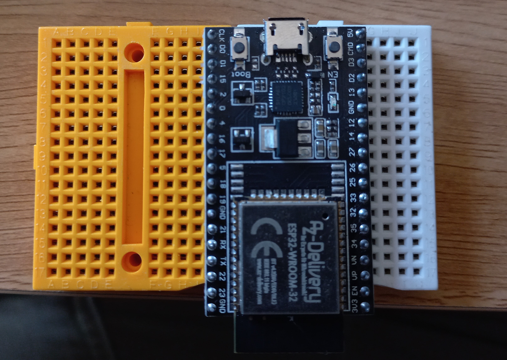
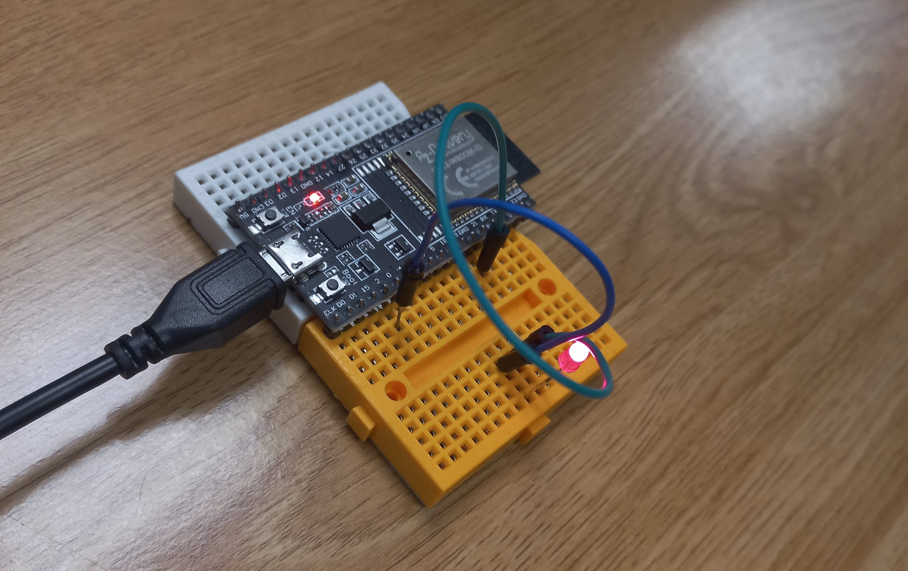
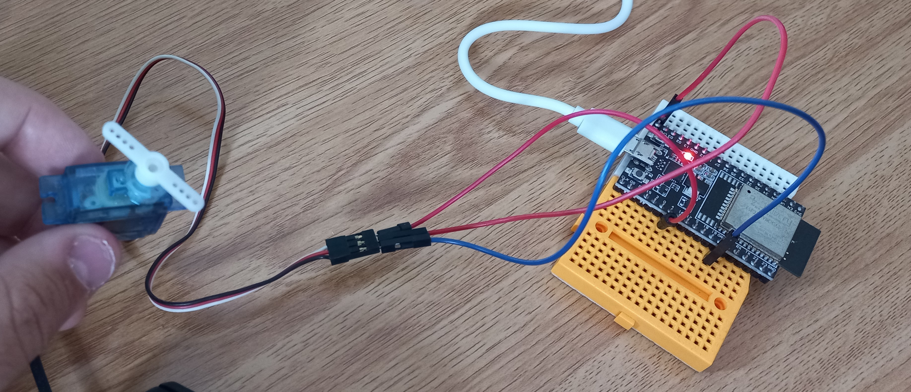
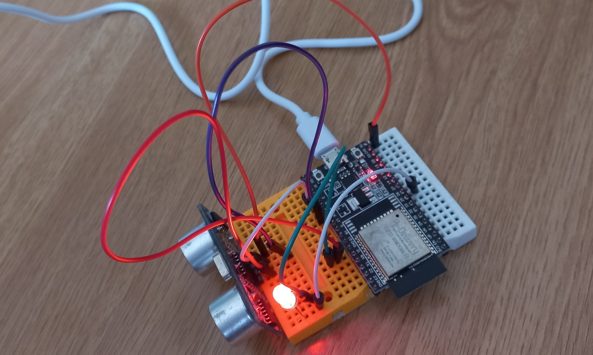

# Prácticas obligatorias arduino

Para todas las siguientes prácticas se ha utilizado una placa arduino ESP32, del siguiente aspecto:

## PRÁCTICA 1
-------

### MATERIALES   

- Un led (luz de color rojo)

### EXPLICACIÓN

El código realizado permite que la luz led conectada se ilumine cada ½ segundo. Conectaremos el polo negativo del LED (la "pata corta") a la toma de tierra y el positivo (la "pata larga") al pin 2. El código no tiene mayor ciencia, con digitalWrite() encederemos/apagaremos el LED y delay() nos permitirá establecer el intervalo de tiempo en milisegundos entre encendido y apagado. 

**Esquema en tinkercad de la práctica:** 

//pendiente introducir captura del tinkercad

**Imagen del montaje:**

## PRÁCTICA 2
-------

### MATERIALES   

- Un servomotor

### EXPLICACIÓN

El código realizado permite que el funcionamiento de un servomotor. Ha sido necesario importar la librería Servo, extraida del siguiente enlace: 

    https://randomnerdtutorials.com/esp32-servo-motor-web-server-arduino-ide/ 
    
Para hacerlo funcionar, conectamos el servo al pin 4, dándole una corriente de 5V. Mediante un bucle for, haremos variar el angulo de giro del servo, permitiendo así el giro esperado.

**Esquema en tinkercad de la práctica:** 

//pendiente introducir captura del tinkercad

**Imagen del montaje:**

## PRÁCTICA 3
-------

### MATERIALES   

- Un sensor ultrasónico HC-SR04

### EXPLICACIÓN

El código realizado permite que cada vez que un detector de movimiento HC-SR04 localize objetos a una distancia inferior a los 20 cm (distancia eficaz escogida por el grupo) encienda una luz LED, y en caso contrario la mantenga apagada. Los conectores trigger y echo del detector los hemos conectado en el pin 2 y el pin 4, respectivamente; y la LED al pin 26. El código imprimirá por consola los detalles de distancia a la vez que encenderá la LED atentiendo a lo descrito anteriormente.

**Esquema en tinkercad de la práctica:** 

//pendiente introducir captura del tinkercad

**Imagen del montaje:**

