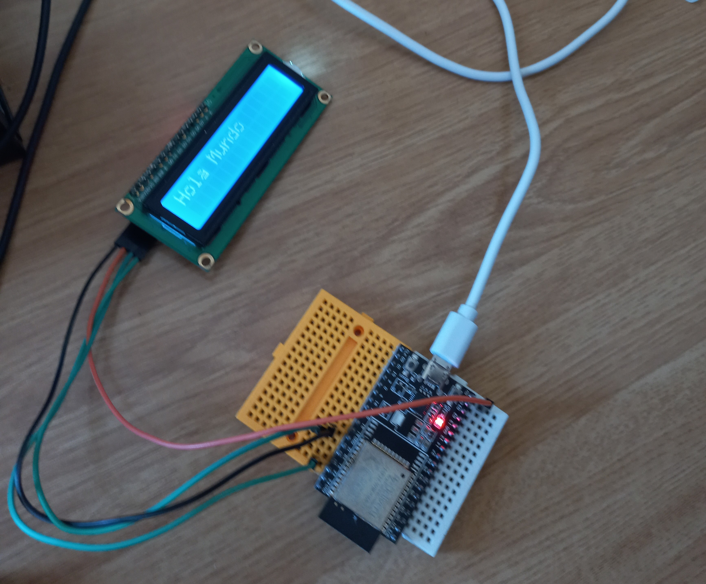

# Prácticas obligatorias arduino

Para todas las siguientes prácticas se ha utilizado una placa arduino ESP32, del siguiente aspecto:

## PRÁCTICA 1
-------

### MATERIALES   

- Un led (luz de color rojo)

### EXPLICACIÓN

El código realizado permite que la luz led conectada se ilumine cada ½ segundo. Conectaremos el polo negativo del LED (la "pata corta") a la toma de tierra y el positivo (la "pata larga") al pin 2. El código no tiene mayor ciencia, con digitalWrite() encederemos/apagaremos el LED y delay() nos permitirá establecer el intervalo de tiempo en milisegundos entre encendido y apagado. 

**Esquema en tinkercad de la práctica:** 

    https://www.tinkercad.com/things/6oi278JYADH?sharecode=HTIvoHtIdXk8-uY0MCxObmZsuCwOSmu0XJYF9Kcmbd0

**Imagen del montaje:**

## PRÁCTICA 2
-------

### MATERIALES   

- Un servomotor

### EXPLICACIÓN

El código realizado permite que el funcionamiento de un servomotor. Ha sido necesario importar la librería Servo, extraida del siguiente enlace: 

    https://randomnerdtutorials.com/esp32-servo-motor-web-server-arduino-ide/ 
    
Para hacerlo funcionar, conectamos el servo al pin 4, dándole una corriente de 5V. Mediante un bucle for, haremos variar el angulo de giro del servo, permitiendo así el giro esperado.

**Esquema en tinkercad de la práctica:** 

    https://www.tinkercad.com/things/6cbIWnVZEHC?sharecode=KFCZxYBxFswGhDxq30St8zhMHeuxsNO_867FXDZYH3Y

**Imagen del montaje:**

## PRÁCTICA 3
-------

### MATERIALES   

- Un sensor ultrasónico HC-SR04

### EXPLICACIÓN

El código realizado permite que cada vez que un detector de movimiento HC-SR04 localize objetos a una distancia inferior a los 20 cm (distancia eficaz escogida por el grupo) encienda una luz LED, y en caso contrario la mantenga apagada. Los conectores trigger y echo del detector los hemos conectado en el pin 2 y el pin 4, respectivamente; y la LED al pin 26. El código imprimirá por consola los detalles de distancia a la vez que encenderá la LED atentiendo a lo descrito anteriormente.

**Esquema en tinkercad de la práctica:** 

    https://www.tinkercad.com/things/9D7e7HjlMN3?sharecode=jHPtudOdX0w6g_NZTNsEyLLJVGMTESxW_lb9Ek-H8o0

**Imagen del montaje:**

## PRÁCTICA 4
-------

### MATERIALES   

- Sensor de humedad y temperatura DHT11

### EXPLICACIÓN

El siguiente código permite mostrar la humedad y temperatura del ambiente por consola usando un sensor

Las conexiones realizadas son las siguientes:
- El pin + a la salida de 5V
- El pin - a tierra
- El pin OUT al pin 2 en nuestro caso 
- 
En primer lugar, instanciamos un objeto dht pasando como parámetros el pin OUT y el tipo de sensor (dht11). Mediante las funciones readHumity y readTemperature realizamos las mediciones deseadas. La función isnan hará saltar un mensaje de error siempre que no se reciban los parámetros deseados. Si no hay ningún error, se imprimen la humedad y temperatura por pantalla. 

Para que funcione el código necesitamos instalar las siguientes librerías:

    https://github.com/adafruit/DHT-sensor-library
---
    https://github.com/adafruit/Adafruit_Sensor

**Esquema en tinkercad de la práctica:** 

    https://www.tinkercad.com/things/05m89IcgBJE?sharecode=D8xyIRo_TdpiCfvEfXtx7Ekw1w6JoPRRy7PkXzqO0_Q

**Imagen del montaje:**

## PRÁCTICA 5
-------

### MATERIALES   

- pantalla lcd

### EXPLICACIÓN

El objetivo de esta práctica es mostrar el mensaje "Hola mundo" en una pantalla lcd que conectaremos a nuestro esp32.
Debemos importar la librería LiquidCrystal_I2C:

    https://github.com/johnrickman/LiquidCrystal_I2C

En primer lugar debemos realizar un código que nos indique la dirección de la pantalla lcd que vamos a usar. En nuestro caso ha salido "0x3F" y es el valor que luego usaremos en el siguiente código al instanciar el objeto liquidCrystal_I2C, junto al número de columnas (16) y filas (2) de nuestra pantalla. El código no necesita un loop, es estático; se basta con el setup en el que imprimiremos el mensaje deseado.

**Esquema en tinkercad de la práctica:** 

    https://www.tinkercad.com/things/aFNaqPwl1nH?sharecode=4PjKtLYetYwIEVsJk52hpivKp-fvKYMNZzFIX9qAm0o

**Imagen del montaje:**

